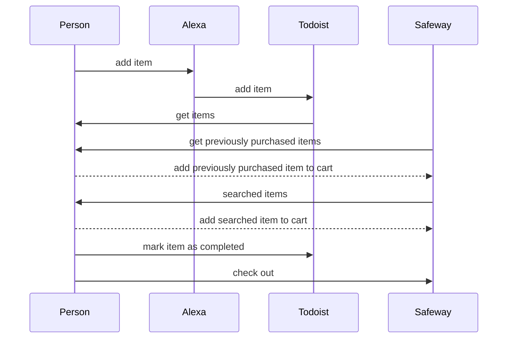

# Grocery Shopping Bot

A [Robot Framework](https://robotframework.org/) bot that takes your Alexa shopping list and uses it to populate an online Safeway shopping cart.

## Manual process replaced by bot

## Run locally with Docker

First build:

    $ ./scripts/build-docker.sh

Then run:

    $ ./scripts/run-docker-build.sh

And, to stop (in a separate terminal):

    $ ./scripts/stop-docker.sh

## Run locally without Docker

### Setup

    $ python3 -m pip install pipenv
    $ python3 -m pipenv shell
    $ pip install pipenv
    $ pipenv install

### Run

    $ python3 -m pipenv shell
    $ ./scripts/run.sh

## Delpoy to AWS

### Setup

#### Prepare Alexa skill

1. Log in to [Alexa Skill Console](https://developer.amazon.com/alexa/console/ask)
1. Create skill:
    1. Click _Create Skill_
    1. Enter a Skill name of Grocery Shopping Bot
    1. Choose a model to add to your skill: Custom
    1. Choose a method to host your skill's backend resources: Provision your own
    1. Click _Create skill_ button (top-right of page)
    1. Choose a template to add to your skill: Start from Scratch
    1. Click _Choose_ button (top-right of page)
1. Set Invocation Name:
    1. Click _Invocation Name_ card
    1. Skill Invocation Name: grocery shopping bot
    1. Click _Save Model_ button (top of page)
1. Copy your Skill ID
    1. Click the Endpoint menu item (under Build)
    1. Copy the Skill ID as you'll need it when you configure your environment variables in the next section

#### Configure environment variables

1. `cp .env.default.yml .env.dev.yml`
1. Edit `.env.dev.yml` and set at least one value for `securityGroupIds` and `subnets`. TODO: details on how to navigate the AWS Console to get the security group and subnets. Also set the value for `alexaSkillId` using the Skill ID you collected in the previous section.
1. `cp env.robot.default.yml env.robot.yml`
1. Edit `env.robot.yml` and set the values to match your environment.

#### Deploy

Note: this can take over 10 minutes to deploy the first time

1. `yarn`
1. `npx serverless deploy --verbose`
1. Copy the outputted value for `ShopLambdaFunctionQualifiedArn`

#### Configure the Alexa skill Lambda ARN

1. Return the Alexa Skill Console
1. Configure the Endpoint:
    1. Click the _Endpoint_ menu item (under _Build_)
    1. Enter the value for `ShopLambdaFunctionQualifiedArn` (retrieved above) in the _Default Region_ (Note: you'll need to strip the trailing `:<number>`), e.g. an ARN of `arn:aws:lambda:us-east-1:123456789012:function:grocery-shopping-bot-dev-shop:4` would become a _Default Region_ of `arn:aws:lambda:us-east-1:123456789012:function:grocery-shopping-bot-dev-shop`
    1. Click the _Save Endpoints_ button (top of page)
1. Build the Model:
    1. Click the _Build Model_ card to build the skill (under the _Build_ menu item)

### Start the bot via Alexa

Simply say _Alexa, open Grocery Shopping Bot_

### Subsequent Deployments

Change the desired files and then run `npx serverless deploy --verbose`

## Remove from AWS

    $ npx serverless remove --verbose
